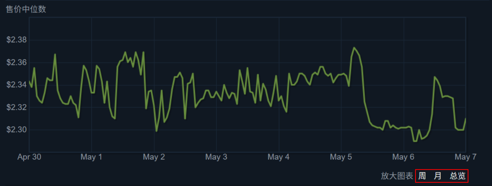
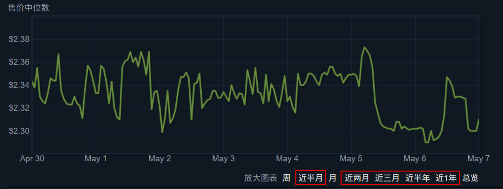

**[简体中文](README.md) | English | [繁體中文](README.zh-TW.md)**

# Extra Steam Community Market Page Buttons
Add extra buttons to the Steam Community Market item details page(Original: Week Month Lifetime)

> Due to the poor knowledge, just share as an interest. 

## Resources URL
- Relevant pages: [GreasyFork](https://greasyfork.org/zh-CN/scripts/440814) | [Github](https://github.com/guchenfeng/ExtraSteamMarketPageButtons)
- Install ScriptGithub: **[script - GreasyFork](https://greasyfork.org/zh-CN/scripts/440814) | [addExtraButtons.user.js - Github](https://github.com/guchenfeng/ExtraSteamMarketPageButtons/raw/main/addExtraButtons.user.js)**

## Related shotcuts

